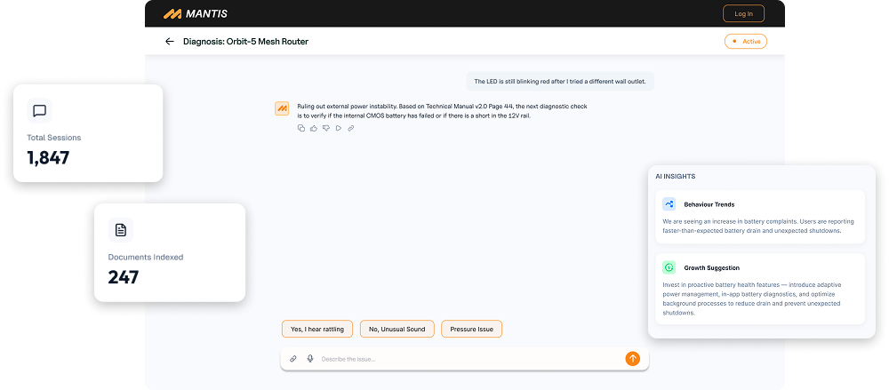

<div align="center">



# 🦗 MANTIS

### Expert diagnosis. Every time.

**An AI technician that troubleshoots any product from its real manuals — powered by [MOSS](https://github.com/usemoss/moss) retrieval.**

Companies upload their products and support manuals. Their customers get a calm, methodical repair technician that reasons over the *actual* documentation, asks the right follow‑up questions, cites the manual page it used, and even reads a photo of the problem.

<sub>Built for the P‑Club UIET hackathon by **Team Legends**.</sub>

</div>

---

## Why MANTIS

Generic chatbots hallucinate fixes. A real technician works from the manual, narrows the cause with questions, and points at the exact page. MANTIS does that — and it is **grounded in MOSS**, so every answer is retrieved from the product's own documentation before the model ever speaks.

> **MOSS is the mandatory retrieval layer.** It is the “R” in RAG: a single shared, cloud‑backed hybrid index (`mantis`) with sub‑10 ms queries. Every chunk is tagged with its `product_id` and retrieved with a metadata filter, so one index scales to every product on the platform. Gemini only ever reasons over what MOSS returns.

---

## ✨ Features

### Must‑have
- **🔎 Manual ingestion → MOSS** — PDFs are parsed (with OCR fallback), chunked, and indexed into MOSS with page‑level metadata.
- **🩺 Technician‑style diagnosis** — streaming, methodical reasoning: probable cause → safe checks → recommended fix. Asks **one** follow‑up question when it needs more signal.
- **📚 Grounded citations** — every claim cites the real manual file + page, validated against the chunks MOSS actually retrieved. *“⚡ Powered by MOSS · 1 ms”* is shown on every answer.
- **🏬 Marketplace + company dashboard** — browse products by category; companies manage products, manuals, analytics and insights.

### Bonus
- **📷 Image troubleshooting** — upload a photo of the fault; Gemini Vision reads error codes / damage and feeds it into retrieval.
- **🖼️ Cited manual page, rendered** — the exact PDF page behind an answer is shown inline as an image.
- **🗺️ Mermaid flowcharts** — multi‑step repair procedures are rendered as a diagnostic flow diagram.
- **💬 Smart quick‑replies** — when the assistant asks a follow‑up, it offers 3 tap‑able answers tailored to *that* question (and hides them on final answers).
- **⏹️ Stop & redirect** — stop a generating answer and send your new message, keeping the partial reply.
- **🗣️ Voice** — speak your problem and hear the answer (Web Speech).
- **👍 Feedback‑driven resolution rate** — 👍/👎 on answers drives the real resolution metric in analytics.
- **📦 Ownership & alerts** — users add products to “My Products” and get warranty/recall/safety + auto‑extracted maintenance reminders.
- **🧠 AI product insights** — the dashboard clusters look‑alike issues (LLM) into the top 3 “Common Issues” and generates *Behaviour Trends* + *Growth Suggestions* from real diagnostic data.

---

## 🏗️ How it works

```
Company uploads manual ──► parse + chunk ──► MOSS index (mantis, tagged product_id)
                                                      │
User describes problem (+ optional photo) ────────────┤
        │                                             ▼
   Gemini Vision (photo) ──► enriched query ──► MOSS hybrid retrieve (filtered, <10ms)
                                                      │
                                          top‑k manual chunks
                                                      ▼
                            Gemini technician loop (stream) ──► cited answer
                                                      │
                          citations validated vs retrieved chunks · page image · flowchart
```

- **Retrieval:** MOSS (mandatory). One shared index, per‑product metadata filter.
- **Reasoning / vision:** Google **Gemini** (`gemini-2.5-flash` family).
- **Transport:** Server‑Sent Events stream the answer token‑by‑token.

---

## 🧰 Tech stack

| Layer | Tech |
|------|------|
| Retrieval | **MOSS** (hybrid search, cloud‑backed) |
| Reasoning / Vision | Google Gemini |
| Backend | FastAPI · SQLModel · SQLite |
| Frontend | Next.js 16 (App Router) · React 19 · TypeScript · Tailwind CSS v4 |
| Ingest | pdfplumber / PyPDF2 / pypdfium2 (+ Tesseract OCR fallback) |

---

## 🚀 Quickstart

**Prerequisites:** Python 3.10+, Node 18+, a [MOSS](https://github.com/usemoss/moss) project (free tier) and a Google AI Studio (Gemini) key.

### 1. Backend
```bash
cd app/backend
python -m venv .venv && .venv/Scripts/activate     # (use source .venv/bin/activate on macOS/Linux)
pip install -r requirements.txt
cp .env.example .env                                # fill in MOSS + Gemini keys
python seed.py                                      # demo company + 3 products (real manuals → MOSS)
python seed_real.py                                 # 7 more real products across categories
uvicorn app.main:app --reload                       # → http://localhost:8000
```

### 2. Frontend
```bash
cd app/frontend
npm install
npm run dev                                         # → http://localhost:3000
```

### 3. Try it
- Open the marketplace, pick **Mi Electric Scooter Pro**, hit **Start Diagnosis**, and ask *“How do I charge it?”*
- Company login: `demo@mantis.app` / `demo12345` → dashboard analytics & insights.

---

## 📁 Project structure

```
app/
├── backend/        FastAPI app — auth, products, MOSS ingest, SSE chat, analytics
│   ├── app/        models · routers · services (ingest, moss, gemini)
│   └── seed*.py    reproducible demo data (real manuals → MOSS)
└── frontend/       Next.js app — marketplace, product + chat, company dashboard
docs/               phase plans & blueprint
```

---

## 👥 Team Legends

- [@Harigithub11](https://github.com/Harigithub11)
- [@prithachanda12](https://github.com/prithachanda12)
- [@nayefsiddique-eng](https://github.com/nayefsiddique-eng)
- [@Primav3ra](https://github.com/Primav3ra)

<div align="center"><sub>MANTIS — diagnosis, grounded in the manual. ⚡ Powered by MOSS.</sub></div>
