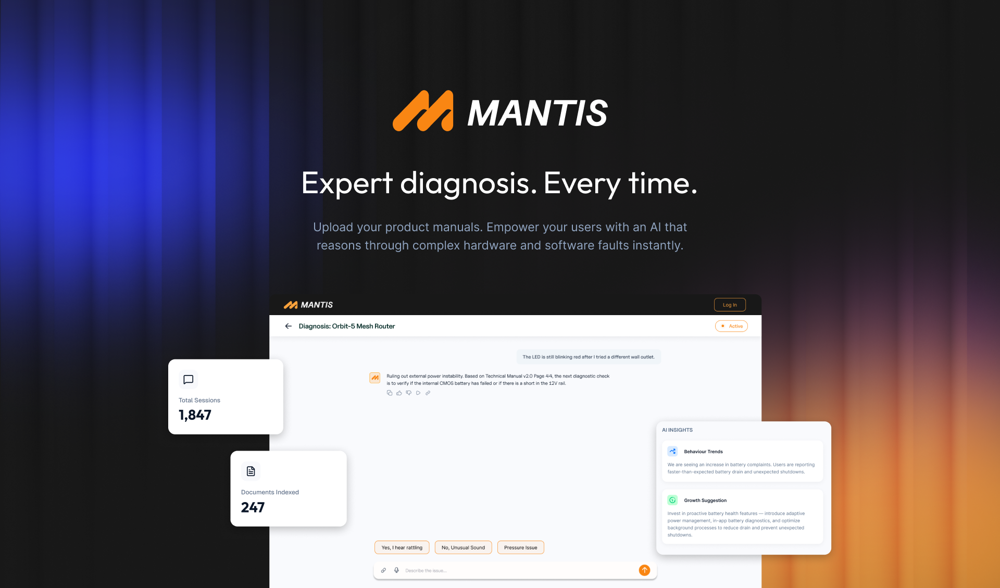
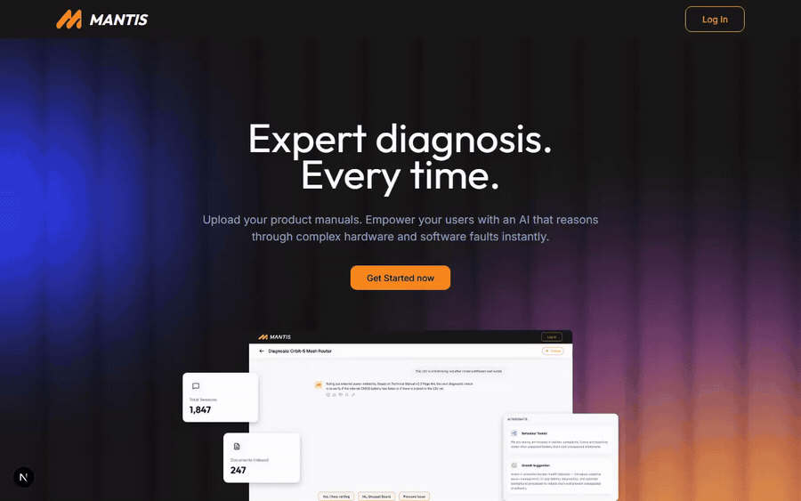

<div align="center">



# MANTIS

### Expert diagnosis. Every time.

**An AI technician that troubleshoots any product straight from its real manuals, powered by [MOSS](https://github.com/usemoss/moss) retrieval.**

Companies upload their products and support manuals. Their customers get a calm, methodical repair technician that reasons over the actual documentation, asks the right follow up questions, cites the exact manual page it used, and can even read a photo of the problem.

<sub>Built for <b>Moss Hack '26</b> by <b>Team Legends</b>.</sub>

</div>

## Demo

<div align="center">



</div>

The demo walks through the landing page, the marketplace, a MOSS grounded diagnosis with the cited manual page shown inline, and the company dashboard with live analytics and AI insights.

## Why MANTIS

Generic chatbots guess at fixes. A real technician works from the manual, narrows the cause with questions, and points at the exact page. MANTIS does exactly that, and it is grounded in MOSS, so every answer is retrieved from the product's own documentation before the model ever speaks.

> MOSS is the mandatory retrieval layer. It is the R in RAG. A single shared, cloud backed hybrid index called `mantis` answers queries in under 10 ms. Every chunk is tagged with its `product_id` and retrieved with a metadata filter, so one index scales to every product on the platform. Gemini only ever reasons over what MOSS returns.

## Features

### Core

* **Manual ingestion into MOSS.** Company PDFs are parsed (with an OCR fallback for scanned pages), chunked, and indexed into MOSS with the page number kept on every chunk.
* **Technician style diagnosis.** The assistant streams its reasoning the way a seasoned repair technician would. It gives the probable cause, the safe checks to run first, and the recommended fix, and it asks one focused follow up question when it needs more detail.
* **Grounded citations.** Every claim points to the real manual file and page, validated against the chunks MOSS actually returned. Each answer also shows how fast MOSS responded.
* **Marketplace and company dashboard.** Customers browse products by category while companies manage their products, manuals, analytics, and insights.

### Bonus

* **Image troubleshooting.** Upload a photo of the fault and Gemini Vision reads error codes or visible damage and feeds that into the search.
* **The cited manual page, rendered.** The exact PDF page behind an answer is shown inline as an image.
* **Mermaid flowcharts.** Multi step repair procedures are drawn as a clear diagnostic flow diagram.
* **Smart quick replies.** When the assistant asks a follow up question it offers three suggested answers you can tap, written for that exact question, and it hides them on final answers.
* **Stop and redirect.** You can stop a generating answer and send a new message while keeping the partial reply.
* **Voice.** Speak your problem and hear the answer read back.
* **Feedback that means something.** A thumbs up or thumbs down on each answer is what drives the real resolution rate shown in the dashboard.
* **Ownership and alerts.** Users add products to My Products and receive warranty, recall, safety, and automatically extracted maintenance reminders.
* **AI product insights.** The dashboard groups similar complaints into the top three Common Issues and writes Behaviour Trends and Growth Suggestions from real diagnostic data.

## How it works

```
Company uploads manual ──► parse + chunk ──► MOSS index (mantis, tagged with product_id)
                                                      │
User describes problem (+ optional photo) ───────────┤
        │                                             ▼
   Gemini Vision (photo) ──► enriched query ──► MOSS hybrid retrieve (filtered, <10ms)
                                                      │
                                          top-k manual chunks
                                                      ▼
                            Gemini technician loop (streamed) ──► cited answer
                                                      │
                       citations validated vs retrieved chunks · manual page image · flowchart
```

1. A company uploads a manual. MANTIS parses and chunks it, then indexes the chunks into the shared MOSS index, tagging each chunk with the product it belongs to.
2. A customer describes a problem and can attach a photo. Gemini Vision turns the photo into a short observation that makes the search sharper.
3. MOSS runs a fast hybrid search, filtered to that one product, and returns the most relevant manual passages in a few milliseconds.
4. Gemini reasons over only those passages and streams back a cited answer, with the manual page shown as an image and a flowchart when the fix has several steps.

## Tech stack

* Retrieval is handled by **MOSS**, using its cloud backed hybrid search.
* Reasoning and vision use **Google Gemini**.
* The backend is **FastAPI** with SQLModel and SQLite.
* The frontend is **Next.js** with React, TypeScript, and Tailwind CSS.
* Document parsing uses pdfplumber, PyPDF2, and pypdfium2, with a Tesseract OCR fallback for scanned manuals.

## Quickstart

You will need Python 3.10 or newer, Node 18 or newer, a [MOSS](https://github.com/usemoss/moss) project (the free tier is fine), and a Google AI Studio key for Gemini.

### Backend

```bash
cd app/backend
python -m venv .venv && .venv/Scripts/activate     # on macOS or Linux: source .venv/bin/activate
pip install -r requirements.txt
cp .env.example .env                                # then fill in your MOSS and Gemini keys
python seed.py                                      # demo company and 3 products, real manuals indexed into MOSS
python seed_real.py                                 # 7 more real products across categories
uvicorn app.main:app --reload                       # serves on http://localhost:8000
```

### Frontend

```bash
cd app/frontend
npm install
npm run dev                                          # serves on http://localhost:3000
```

### Try it

Open the marketplace, pick the Mi Electric Scooter Pro, press Start Diagnosis, and ask how to charge it. To see the company side, log in with `demo@mantis.app` and the password `demo12345`, then open the dashboard for analytics and insights.

## Project structure

```
app/
  backend/      FastAPI app for auth, products, MOSS ingest, the SSE chat, and analytics
  frontend/     Next.js app for the marketplace, product and chat pages, and the company dashboard
docs/           planning documents and the demo video
```

## Team Legends

* [Harigithub11](https://github.com/Harigithub11)
* [prithachanda12](https://github.com/prithachanda12)
* [nayefsiddique-eng](https://github.com/nayefsiddique-eng)
* [Primav3ra](https://github.com/Primav3ra)

<div align="center"><sub>MANTIS. Diagnosis, grounded in the manual. Powered by MOSS.</sub></div>
